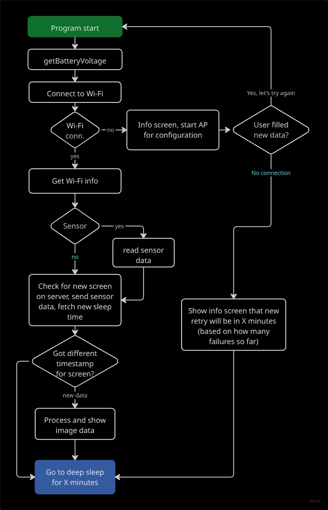

# Živý obraz - firmware

Welcome to the Živý obraz repository with firmware for e-Paper development boards based on ESP32/ESP32-S3. Live Image is used to feed ePaper/e-Ink displays with image data from a web server, whether it is a bitmap or a custom basic RLE format called Z1/Z2/Z3.

  * Basic information can be found on the project website: https://zivyobraz.eu/ (Czech)
  * Specific information regarding getting things work can be found in the documentation at: https://wiki.zivyobraz.eu/ (Czech)
  * Firmware supports many boards, you can find specific hardware for Živý obraz to buy at [LáskaKit](https://www.laskakit.cz/vyhledavani/?string=%C5%BEiv%C3%BD+obraz) and [Pájeníčko](https://pajenicko.cz/vyhledavani?search=%C5%BEiv%C3%BD%20obraz).

**The documentation also includes precompiled firmware for flashing several of the most common types of ePapers, or you can use the web installer in Edge/Chrome browsers at: [instalace](https://zivyobraz.eu/?page=instalace)**
**The default password for the Wi-Fi that the board transmits after uploading the firmware is: `_zivyobraz_`**

----

In brief, about custom compilation and settings in the firmware code:

You will need to have the following libraries installed:
> zinggjm/GxEPD2@^1.6.0
> adafruit/Adafruit GFX Library@^1.11.9
> adafruit/Adafruit SHT4x Library@^1.0.3
> adafruit/Adafruit BME280 Library@^2.2.4
> sparkfun/SparkFun SCD4x Arduino Library@^1.1.2

In **platformio.ini**, comment out default build flags under section **common** (they are specified here for automatic compilation checks on GitHub), so you can use your own display type for compilation in next steps:
> build_flags =
> \# -D TYPE_BW      # Comment out this for your own display type enabled by you in main.cpp
> \# -D D_GDEW0154T8 # Also comment out this

In code **board.h** do not forget to uncomment:
1. Type of board used (ESPink_V2, ES3ink, ...)
2. If you plan to connect one of the supported sensors via uŠup for reading temperature, humidity, and pressure/CO2 and sending the values to the server, uncomment in **sensor.h**
> //#define SENSOR
3. Display type has to be changed in **display.h** In the case of GRAYSCALE, you must remove `zinggjm/GxEPD2` from **platformio.ini** (just comment it out), otherwise there will be a library collision and the code will not work. In that case, `lib/GxEPD2_4G` will be used. For other displays (BW, 3C, 7C), leave `zinggjm/GxEPD2` active, you don't need to do anything with the 4G version.
> #define TYPE_BW          // black and white
> //#define TYPE_3C        // 3 colors - black, white and red/yellow
> //#define TYPE_GRAYSCALE // grayscale - 4 colors
> //#define TYPE_7C        // 7 colors
4. Uncomment the definition of the specific ePaper you are putting into operation. This section begins at line `8`, and you need to select a specific display, e.g.:
> // BW
> //#define D_GDEY0213B7  // 122x250, 2.13"
> //#define D_GDEW042T2   // 400x300, 4.2"
> #define D_GDEW075T7     // 800x480, 7.5"

After successfully compiling and flashing the board, continue with the documentation "Bringing your own ePaper to life":
https://wiki.zivyobraz.eu/doku.php?id=start#oziveni_vlastniho_epaperu

----

**Simple diagram of how it works**

